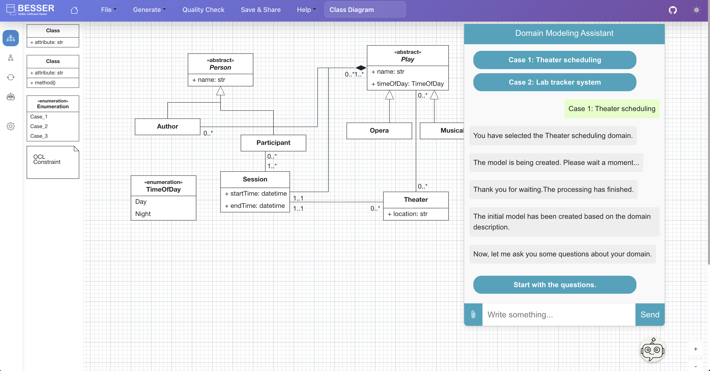

# Human-in-the-loop LLM-assisted Domain Modeling 

In this session we will use the BESSER Web Modeling Editor (WME) and an AI assistant that helps you create UML class diagrams through a conversational interface. [Click on this link to access the tool](https://streamlit-rule-agent.azurewebsites.net/).

---

## Tool Overview

The application has **two main components**:




### 1. **BESSER Web Modeling Editor**
- Displays the UML class diagram being edited with the chatbot assistant.
- The UML class diagrams includes classes, attributes, enumerations, and relationships.
- Updates automatically after each answer.

### 2. **Chat assistant (Bottom Right)**
- Click the chat icon to expand/collapse.
- Answer questions about the domain model.
- Configured to work with [two exercises](resources/Exercises_domain_modeling_assistant.pdf).

---

## Phases in the Modeling Assistant

### **Phase 1: Initial modeling phase**
- Select your expertise in UML class models. 
- Select one of the [two exercises](resources/Exercises_domain_modeling_assistant.pdf) to model.
- Please work on each exercise in a new browser window.

The chatbot will propose an initial model for the domain in the text description. 

### **Phase 2: Refinement modeling phase**
The assistant will raise questions to refine presenting two alternatives

**Example Question:**
```
Should the relationship between Requisition and Appointment be modeled as a composition or as an association?

For example:
1. Use composition, Appointment would depend on Requisition for its existence.
2. Use association, Appointment could exist independently of Requisition, and can also be linked to multiple requisitions.

Which option is better for you?

Option 1: Composition is needed because class Appointment depends on Requisition.
Option 2: Association is sufficient because class Appointment exists independently of Requisition.
```

**For your answer:**
- Select Option 1 or Option 2 based on the understanding of the domain.
- If you have doubts, select "I am not sure and need help to decide" to forward the question to an LLM for a suggested the answer

**Assistant actions:**
- After each answer, the diagram is updated if needed.
- When all the questions are answered, the chatbot shows the Final proposed model. 

### **Phase 3: Review the Final Model**
After all questions are answered:
- You can select between the Initial Model or Final Model proposed.
- You can continue editing the model in the BESSER modeling editor.

---

## Survey of the tool

We kindly ask you to complete a short survey about your experience using the tool: [Click on this link to access the survey](https://forms.office.com/e/vs16u9q1b7).

